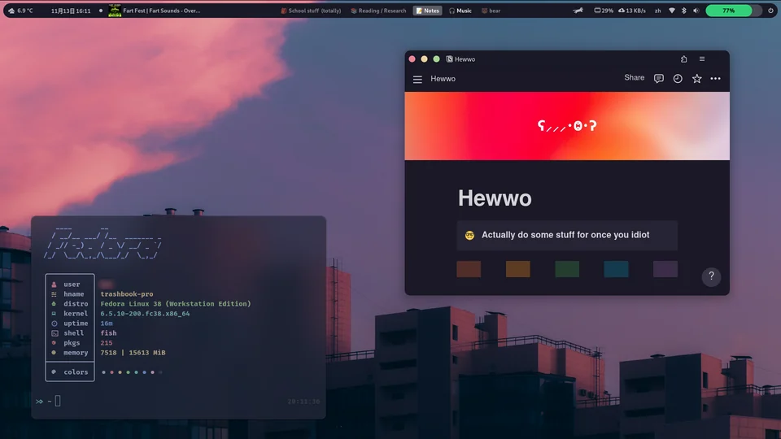

# Dotz




# ⚠️ HEADS UP!!!!! ⚠️

Some of the extensions and the theme are incompatible/broken on the latest GNOME version (GNOME 45)

************************PLEASE DON’T UPDATE TO THE LATEST GNOME VERSION IF YOU WANNA USE THIS SETUP!!!************************

THAT ALSO MEANS DON’T UPGRADE TO THE LATEST FEDORA VERSION OR THE LATEST UBUNTU VERSION AS THEY BOTH USE THE GNOME 45

Expect some significant performance and battery life downgrades when using all of the extensions, especially on a laptop. If you still want this setup but without any significant sacrifices disable the Rounded Window Corners extension and the Blur My Shell extension.

Also expect that some apps might look weird as GTK theming not an officially supported feature

## A tiny message before the actual tutorial (im sorry)

### THIS PAGE IS NOWHERE DONE!!!!!

also:

If you feel like anything is lacking or unclear, don’t hesitate to ask me! I also constantly struggle with installing stuff my self cuz im fat idiot.

**Also to the more seasoned linux users:** I don’t really know much coding or how to write these dot file page-whatevers. I use linux mainly because i have apps that I like that works better/only on Linux and also because windows is a buggy and laggy mess.

If you have any other feedback on how i can improve stuff pls lemme know

If anyone is interested on how to replicate something like this on Windows lemme know! It might be actually be possible to make it look quite nice using Niivu’s themes and DropTopFour :)

# Quick chip and bits:

**Theme:**  [https://github.com/catppuccin/gtk](https://github.com/catppuccin/gtk)

(I personally used Macchiato-Standard-Red)

**Icons:** [https://github.com/PapirusDevelopmentTeam/papirus-icon-theme](https://github.com/PapirusDevelopmentTeam/papirus-icon-theme) plus [https://github.com/catppuccin/papirus-folders](https://github.com/catppuccin/papirus-folders)

**Wallpaper:** [https://github.com/Gingeh/wallpapers/blob/main/landscapes/evening-sky.png](https://github.com/Gingeh/wallpapers/blob/main/landscapes/evening-sky.png)

**Cursor theme that I use:** [https://github.com/ful1e5/Bibata_Cursor](https://github.com/ful1e5/Bibata_Cursor)

I just thought that these cursors looked super cute 😛

**********************************************Cursor theme that probably fits in better:********************************************** [https://github.com/catppuccin/cursors](https://github.com/catppuccin/cursors)

************Font:************ Default GNOME font

pls recommend me a good font if you know one :)

**Bootloader/GRUB:** [https://github.com/catppuccin/grub](https://github.com/catppuccin/grub)

**Boot screen/plymouth:** [https://github.com/catppuccin/plymouth](https://github.com/catppuccin/plymouth)

**Login scrren/GDM:** Scroll down for details

Fetch: [https://github.com/ssleert/nitch](https://github.com/ssleert/nitch)

# Necessary GNOME extensions:

- [Aylur's Widgets](https://extensions.gnome.org/extension/5338/aylurs-widgets/)
- [Blur My Shell](https://extensions.gnome.org/extension/3193/blur-my-shell/)
- [Just Perfection](https://extensions.gnome.org/extension/3843/just-perfection/)
- [Mpris Label](https://extensions.gnome.org/extension/4928/mpris-label/)
- [OpenWeather](https://extensions.gnome.org/extension/750/openweather/)
- [Remove App Menu](https://extensions.gnome.org/extension/3906/remove-app-menu/)
- [RunCat](https://extensions.gnome.org/extension/2986/runcat/)
- [Search Light](https://extensions.gnome.org/extension/5489/search-light/)
- [Userthemes](https://extensions.gnome.org/extension/19/user-themes/)
- [Vitals](https://extensions.gnome.org/extension/1460/vitals/)

## The extensions that require a bit of extra configuration:

### Aylur’s widgets

Turn on these 

- Battery bar (With “Show Icon” disabled)

Note: I decreased the height a bit by a couple of pixels after I took the screenshot

- Dynamic panel (Be sure to enable “Floating”)
- Power Menu
- Quick settings:

**Show System Levels:** Off

**Style:** Normal

**Media player:** 

Style**:** Full 

Cover Width: 500

Cover Height: 170


> 💡 Extra note:
> I disabled the Stylish on screen display as it broke some OSD popups from some other extension I use


### Blur My Shell

1. Turn **********************everything********************** off except for application blur.
2. Add your desired apps to the list (In my case it was only the terminal)
    
    Note: Since the “Add Window” is kinda broken (at least for me), we have to manually figure out what the application that we wanna blur is called.
    
    - If your application is installed through you package manager:
        
        List your installed packages (google it if you don’t know how to) and find the name of your application, then paste it into Blur My Shell (I think it’s done this way idk since was too lazy to try this, tell me if it doesn’t work)
        
    - If your application is installed through Flatpak:
        
        Find your app on [Flathub](https://flathub.org) and click on the drop-down arrow next to the Install button. Copy the last part of the command (doesn’t matter which one) and paste it into Blur My Shell!
        
    - If your application is installed through Snap:
        
        Idk how to do it bc i dont use snap oops pls tell me if you know how to do it and ill put it here :)
        


> 💡 Extra note:
> 
> I set my opacity to 178 as I think it was the best balance between readability and cool-nes


### Just Perfection

- Hide the power/battery icon
- Notification position → Top End
- Date/time → To The Right

 

### Mpris label

- Position → Extension place → Left
- Album art scaling → 60
- Under the **Label** tab → Hide the album in **********Visible fields and order**********

### OpenWeather

- Position in panel → Left

### Search Light

- Border radius → Turn it up a bit until it looks good
- Background color → use the picker tool and pick the UI background in the popup windows

### Spacebar

- Position in top panel → Center


> 💡 - To rename your workspaces/desktops right-click on the menu in the top bar. If you wanna use emojis use this: [https://flathub.org/sv/apps/it.mijorus.smile](https://flathub.org/sv/apps/it.mijorus.smile)


Extra: I set the border radius to 255 to make the highlights more rounded and make it fit better after I took the screenshot

# Getting the window header

1. Install Gnome Tweaks
2. Copy these settings:


# Login screen/GDM

As far as I know there isn’t any catppuccin GDM theme :(

But what I did instead is this:

1. I installed GDM Settings: [https://flathub.org/apps/io.github.realmazharhussain.GdmSettings](https://flathub.org/apps/io.github.realmazharhussain.GdmSettings)
2. I clicked this


3. I picked the background color of the UI in the popup

It’s not a perfect solution but I thinks it’s way better than just leaving it at default

# How to spice up the terminal

1. Install a little bit of this: [https://github.com/fish-shell/fish-shell](https://github.com/fish-shell/fish-shell)


> 💡 To make fish your default shell follow this guide: [https://askubuntu.com/a/26459](https://askubuntu.com/a/26459)
> *Also not all commands in fish are exactly the same as in Bash. If you encounter any trouble you can just start Bash in your terminal and continue there*


2. Then pepper a bit of this: [https://github.com/oh-my-fish/oh-my-fish](https://github.com/oh-my-fish/oh-my-fish)
3. Then make it cool with this: h[ttps://github.com/catppuccin/fish](https://github.com/catppuccin/fish)
4. To get the ****************E P I C**************** icons install a font of your choice: [https://www.nerdfonts.com/](https://www.nerdfonts.com/)
    
    (I personally used FiraCode :D)
    
5. Install Black Box (the terminal app) 
    
    link: [https://flathub.org/sv/apps/com.raggesilver.BlackBox](https://flathub.org/sv/apps/com.raggesilver.BlackBox)
    
6. Toggle these:
    - General → Header Bar → Show Header Bar → ******OFF******
    - General → Header Bar → Floating Controls → Show Floating Controls: ****ON****
    - Terminal → Terminal → Padding → 10
7. To install the theme:
    
    1.  Download one of these: [https://github.com/catppuccin/tilix/tree/main/src](https://github.com/catppuccin/tilix/tree/main/src)
    
    1. Under Terminal→Theme click the folder icon
    2. Copy the previously downloaded .JSON file and put it in the ******************Schemes****************** folder
    3. Restart ****************Black Box****************
    4. Navigate back to the theme settings and select your theme
    5. Assuming you configured **********************Blur My Shell**********************  properly (mentioned in the previous section) your terminal should look something like this now:
    
    
    

### Extra stuff

- To move the window without the title/header bar hold down the Windows/Super key and move the window :)
- To get some extra icons when listing your files in the terminal use this: [https://github.com/lsd-rs/lsd](https://github.com/lsd-rs/lsd)
- To get that cool system info-whatever screen I showed in the screenshot install this: [https://github.com/ssleert/nitch](https://github.com/ssleert/nitch)

# Epic-fy your spotify:

1. Install Spicetify: [https://spicetify.app/docs/getting-started#shell-pre-built-binary](https://spicetify.app/docs/getting-started#shell-pre-built-binary)


> 💡 If you are getting a “can’t find the command spicetify error” just restart your terminal


> 💡 If you are getting an error about spicetify noting finding the config file, make sure to properly read through this:[https://spicetify.app/docs/advanced-usage/installation#note-for-linux-users](https://spicetify.app/docs/advanced-usage/installation#note-for-linux-users)
> I wasted hours not realizing what I did wrong installing it for the first time
>
> After this you might getting an error saying that you lack permission to edit the files. In that case type this command into your terminal (with your username of course):


```bash
sudo chown you-user-name /var/lib/flatpak/app/com.spotify.Client/x86_64/stable/active/files/extra/share/
```

1. Head over to the marketplace and install these:


1. Enjoy 😎

# Notion

For this to work you need to install Notion as a PWA in you preferred browser


> 💡 If you wanna use Firefox you need [this](https://addons.mozilla.org/firefox/addon/pwas-for-firefox/)


1. Install the Stylus browser extension in your PWA: [https://github.com/openstyles/stylus/#readme](https://github.com/openstyles/stylus/#readme)
2. Install this theme: [https://userstyles.world/style/3838/notion-catppuccin](https://userstyles.world/style/3838/notion-catppuccin)
3. Voila!

# Web browser

WIP

# Discord

**************Theme:************** [https://github.com/catppuccin/discord](https://github.com/catppuccin/discord)

I know that this page looks kinda broken atm bc i just made this in notion and then exported it as a markdown file ill fix it later
